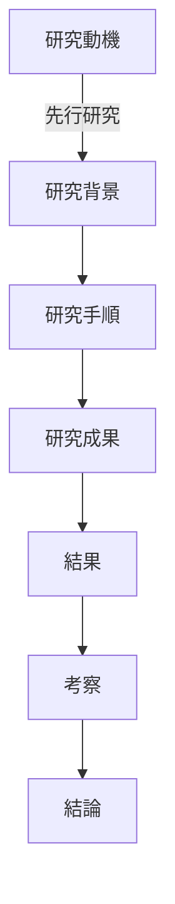

# 10:20~11:40 
## 2人目

* 安藤Tに詰められる：質問の意図がわからない時は、きちんとその旨を伝える。黙るなし。誠意に伝える。
* 普通に専門外の人に伝わるように専門用語のイメージを用意しておくべき
* 難しい言葉ほどやさしく

* 研究動機に関してはgood
* 実験手順ほど、フローチャートにまとめるべき

* 結果に関する考察っていらないの？
* 結果ありきの発表会みたいになっていないか？

* 詰まったときにきちんとわからないことと所見を述べるとよい
**素人(ある程度の見識あり)に見せてわからないことやイメージの湧きにくい言葉などをきちんと質問してもらった方がよきかもね**

* 自分の研究の何が新規性なのかいまいちわからない

## 3人目(海住研)
* スライドがみんな統一ww
* 34aspect
* 図を多用するの好きだよね
* めっちゃ同じ配置
* 図はどうやって作っているの
* 発表の緩急つけないほうがよき？
* アニメーションつけるべきか！？
* 文字じゃなくて図を使って説明するスタイル(→めっちゃ練習してそう)

* 観測できなかったの! こういう場合ってどうすればいいんだ！？

* 実験研なだけに、作り方に均一性はなし
* 補足資料がうまいwww
* 安藤先生怖い
* 一番かな
* 岡田みたいなタイプ

## 4人目
* 覇気をだせ
* 単調
* 字が小さい(数式の定義が見えるようにスライド作成)
* 字体が嫌い、、、ちゃっちい
* 数式のラベルつけたほうが良いな
* 予行演習してないことバレバレなことは語尾からわかるかもね
* 写真じゃないんだから、真ん中に配置しようよ

* 渡辺先生。。。。。。わかりません

# 11:50~

## 石榑研
* スライド24枚は多すぎ問題で怒られていた

# 14:00~
## 1人目

* スライド綺麗
* 声が小さすぎて何も聞こえない
* 20分超えても設問責め　
* なぜマイクを使わない？？

## 2人目
* 単調すぎて眠い
* 先生の質問が。。。。

# 15:10~
## 1人目(海住研)

* スライドが同じ
* スライドの図が同じ
* 実験工程の説明をしないといけないのか
* 定性的な評価(のように見える)って、主観じゃない
* 応用性(質問されたね。安藤先生に)が不透明でバックグランドがないからわからない
* 108枚スライドの準備
* 0.2%でMR効果と認定されているのですが？←石榑T
* 東大離散最強

対話型だよね。質疑応答というか

